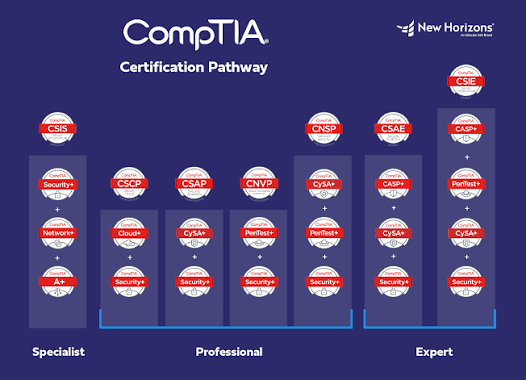

## Overview
This is less of a project, and more of a class. However, at the end of the class students were allowed to take a certification test for a Comptia certification. In this class I learned about the basics of ethical hacking and cyber security, and in-class we would spend a lot of time going through simulations of the basic things ethical hackers would encounter while working. We would also learn how to use Linux OS, and would also learn about cyber safety and how to recognize dangerous situations on the internet. We were encouraged to also try to teach what we learned to others, as cybersecurity is something that is always changing, and the methods to harm people online are always changing as well. 

## What I learned
From this class I learned what I wanted to do in life. I figured that I would want to go into cybersecurity in the future, and this class greatly inspired me to pursue this career path. I also learned a lot of basic cyber security and the basics on how Linux OS works. This class led me down the cyber security pipeline, and I ended up learning lots on my own, and I started to connect more with my family because as it turns out, a lot of my relatives work in cyber security. 