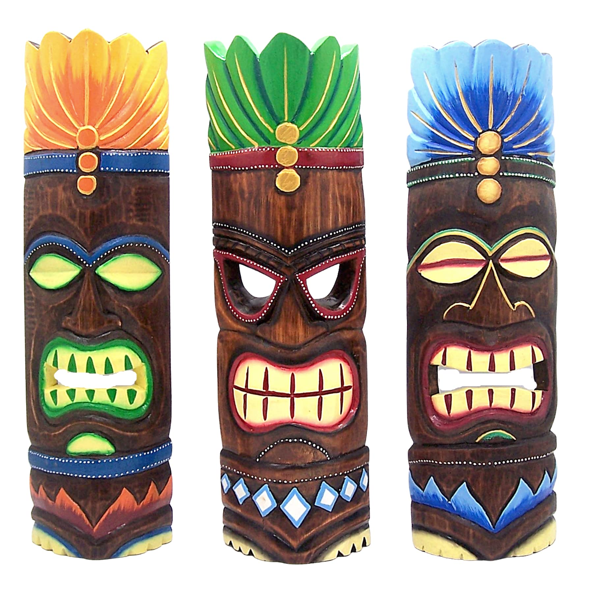

## Overview
This was the penultimate project for a video game design class I took in 2020. It was a summer school class that I took that sought to teach Unity to students, and the idea was to have students take what they learned and apply it. For my project, I created a 2D platformer shooter game, where you play a guy shooting a water gun at these tiki maske enemies, with there being 2 levels and a final boss level with a giant tiki mask that shot fireballs. I coded the entire project in Unity game engine, and did all the pixel art used in the game myself. Unfortunately, the laptop I created the project on I no longer have access to so I have nothing to show for it.

## What I learned
From this project I learned basic C# coding language, and I also learned how to navigate the Unity game engine. I learned how to create a relatively good feeling game, and learned all of the basics required to make a small test-demo-like game. At this point, I had always been interested in coding and this was my first real dive into trying to learn coding languages, and from here I learned that I really enjoyed coding and programming. 